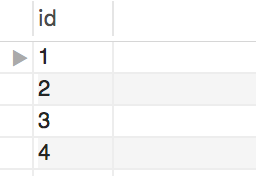

# Joins Are From Descartes, Rows Are From Schemas


### Part 1

* The outputs of following queries are 25 and 10, respectively.

  ```sql
  SELECT COUNT(*)
  FROM first_table;

  SELECT COUNT(*)
  FROM second_table;
  ```

* What will be the number of rows in the output of the following query?

  ```sql
  SELECT *
  FROM first_table, second_table;
  
  ```  
 ANSWER: 250

### Part 2

* The query `SELECT * FROM table_one;` returns the following:

  

* And the query `SELECT * FROM table_two;` returns the following:

  

* What will the query `SELECT * FROM table_one, table_two;` look like?

ANSWER: It will match each item from table_one to table_two resulting in 12 rows.

Table_one, Table_two;
1,10;
1,11;
1,12;
2,10;
2,11;
2,12;
3,10;
3,11;
3,12;
4,10;
4,11;
4,12

* _You can use pgAdmin and create a new table to test out this activity_
