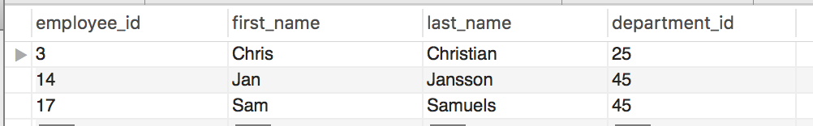

# Alter vs. Update

### Part 1

* Explain the difference between `alter` and `update` in SQL statements.

Answer:

Found this really good description of the differences.  

ALTER is a DDL (Data Definition Language) statement,  
used to update the structure of the table (add/remove field/index etc).  
Whereas UPDATE is a DML (Data Manipulation Language) statement,  
used to update the data in a table.  

### Part 2

* You are given the following table:

  

* Change the name of the column from `department_id` to `dept_id`.

* Add a column named `annual_salary` to the table.

* _You can use pgAdmin and create a new table to test out this activity_
* _Save your completed SQL file in this folder._
