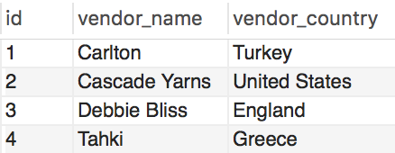

# SQL Joins

## Part 1

* Describe the different types of join clauses supported in SQL.  

ANSWER:  

- Inner Join: Returns only records which exist in both tables  
- Left Join: Returns all records from the 1st (or left) table  
	and any records which have a matching foreign key value f  
	rom the 2nd (or right) table.  
- Right Join: Returns all records from the 2nd (or right) table  
	and any records which have a matching foreign key value f  
	rom the 1st (or left) table.  
- Full Outer Join: Returns all records from both tables  

Using these joins its also possible to return inverse joins.  

- Inverse Inner Join: Returns all records which exist only in the left  
and right tablels and not those which exist in both tables  
- Left Outer Join: Returns all records which exist only in the 1st (or left) table  
	and none of the records which have matching foreign key values  
	from the 2nd (or right) table.  
- Right Outer Join: Returns all records which exist only in the 2nd (or right) table  
	and none of the records which have matching foreign key values  
	from the 1st (or left) table.   

## Part 2

* Consider the following tables:

  * vendor_table
  

  * yarn_table
  

* Which join was used to create the final view below?

  

ANSWER:  

Select v.vendor_name as "Vendor Name",  
		v.vendor_country as "Vendor Country",  
		y.yarn_name as "Yarn Name",  
		y.yarn_type as "Yarn Type"  
from vendor_table v  
left join yarn_table y  
on v.id = y.vendor_id;  

* _You can use pgAdmin and create a new table to test out this activity_
